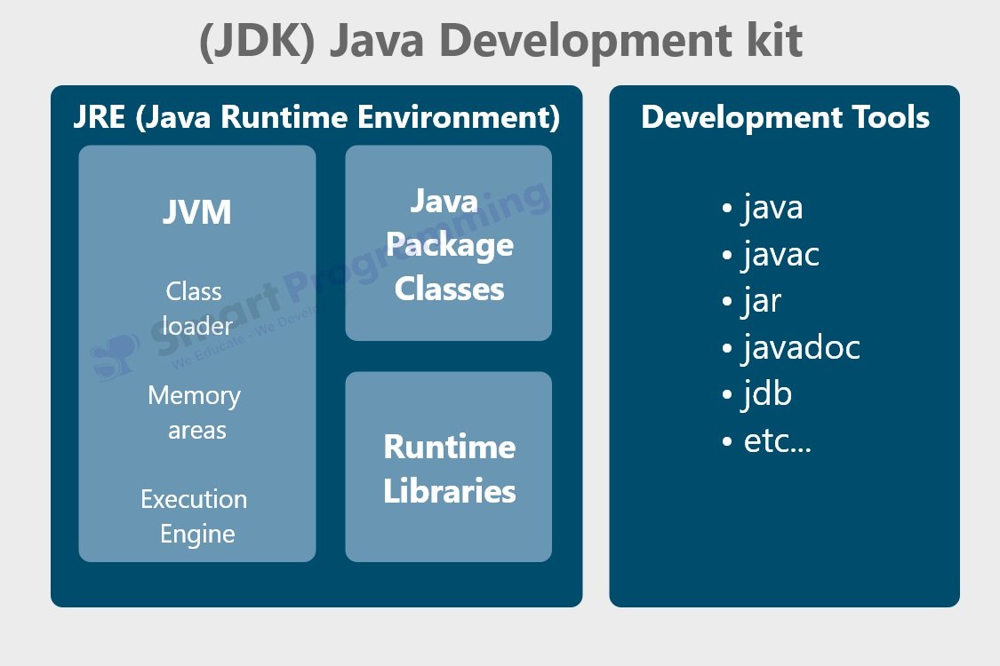
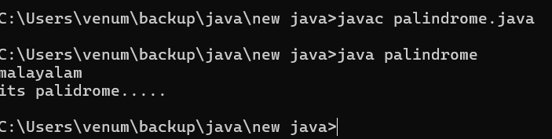

# JVM Basics

# JDK (java development kit) 

- JDK (Java Development Kit) is the complete package used to develop Java applications. It includes tools like the Java compiler (javac), debugger, and the JRE. Developers use the JDK to write, compile, and run Java programs.
- JRE (Java Runtime Environment) provides the environment required to run Java applications. It includes the JVM and the core libraries needed to execute Java programs, but it does not include development tools like the compiler.
- JVM (Java Virtual Machine) is the engine that runs Java programs. It takes the compiled Java bytecode and converts it into machine-level instructions that the operating system can understand and execute.

# Byte Code

Bytecode is the intermediate code generated when a Java source file (.java) is compiled using the Java compiler (javac). Instead of converting directly into machine code, Java code is first converted into bytecode (.class files).

This bytecode is platform-independent, meaning it is not tied to any specific operating system or hardware. The JVM reads this bytecode and translates it into machine code at runtime.

Explanation with photographs

The javac commands complies the java code and gives the .class file that is the byte code. \
We can run that byte code in any machine using java command.