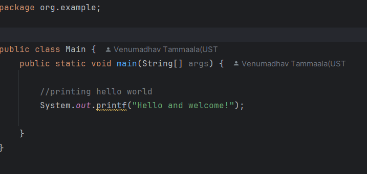

# Setup Instructions

## JDK Version Used
- JDK: 23
- Build Tool: Maven 3.x

You can verify the installed versions using:

```bash
java -version
mvn -version
```

Hello world program with execution:



The Main class contains the application entry point. \
The main method is the standard starting point of every Java program. 

public is the access modifier, which allows the JVM to access the method. \
static means the method belongs to the class and can be executed without creating an object. \
void is the return type, which means the method does not return any value. 

The main method follows the standard Java syntax required for program execution. 